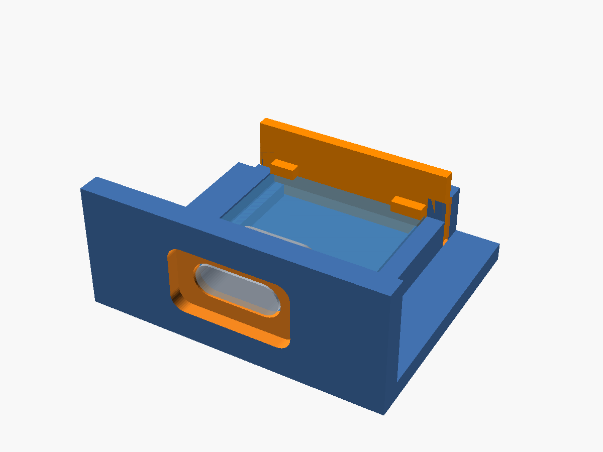
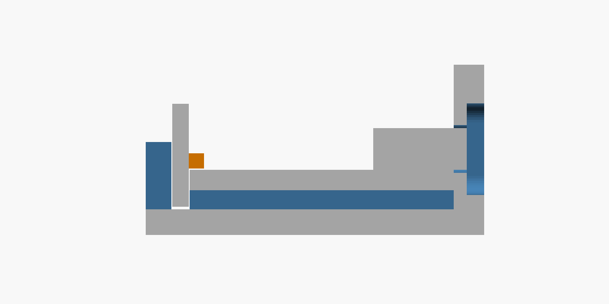

# Enclosure

## Status

| Part | State |
|---|---|
| USB-C wall + cradle **test coupon** (`usb_wall_test.scad`) | Ready to print. Two dimensions still need measuring. |
| Full enclosure | Not started. It waits on the coupon results and the TSA5001's dimensions. |

## Test coupon



**What it's for:** a small print to check the port design before the full box.

- Does the QT Py's USB-C shell line up with the wall opening?
- Do real cables seat fully?
- Do plug-in and pull-out forces go into the printed parts instead of the board's solder joints?

**How it holds the board:**

| Force | Taken by |
|---|---|
| Pull-out (cable yanked outward) | The board's front edge presses against the wall's inside face |
| Push-in (plugging in) | The drop-in clip (`key`) behind the board's back edge |
| Up/down wiggle, front | The USB shell sitting in the wall opening |
| Up/down, back | The clip's two corner lips over the board top |
| Side to side | Pocket side walls, flush with the board top so the edge pads stay reachable for soldering |

**Cross-section through the port centreline.** Grey = cut faces, blue = coupon beyond the cut, orange = clip lip.



## Before printing: measure two values

These aren't in Adafruit's board file. I used typical values; calipers on your board settle them.

| Parameter in `usb_wall_test.scad` | Current value | What to measure |
|---|---|---|
| `pcb_t` | 1.60 mm (assumed) | Board thickness, away from any parts |
| `usb_h` | 3.26 mm (typical top-mount shell) | USB-C shell height, board top to shell top |

After editing them:

1. Run `tests/check_fit.sh`. Every line should say `ok`, `clear` or `contact only`, and the exit code should be 0.
2. Re-export both parts:

   ```
   openscad -o stl/usb_wall_test_coupon.stl -D 'part="coupon"' usb_wall_test.scad
   openscad -o stl/usb_wall_test_key.stl    -D 'part="key"'    usb_wall_test.scad
   ```

   (`fit_checks.scad` repeats the board numbers; update them there too.)

Every other board dimension comes from Adafruit's Eagle `.brd` file: the outline, USB-C position, how far the shell overhangs the board edge (1.03 mm), and the part positions.

## Printing

| Setting | Suggestion |
|---|---|
| Files | `stl/usb_wall_test_coupon.stl`, `stl/usb_wall_test_key.stl` |
| Orientation | As exported. The coupon sits on its base; the clip lies on its back with the lips up. |
| Supports | None. The port opening and pocket are short bridges (~9–13 mm). |
| Material | PLA or PETG for the test. **Not** carbon-fibre-filled (that rule matters most near the antenna in the final box). |
| Layer height | 0.12–0.16 mm gives a cleaner port opening; 0.2 mm is fine for a first look. |
| Walls | 3 or more perimeters |

## Test steps

1. Lower the board into the cradle about 1.5 mm back from the wall.
2. Slide it forward until the USB shell enters the opening and the board edge touches the wall.
3. Drop the clip into the two slots behind the board.
4. Plug in several different cables, including one with a thick plug housing. Check each one:
   - Does it click fully in?
   - Does the board move?
   - Does the plug housing hit the wall before the plug is fully in?
5. Wiggle a plugged-in cable up, down and sideways. Watch whether the board flexes.

## Tuning parameters

| Symptom | Change |
|---|---|
| Board too tight or loose in the pocket | `fit` (default 0.20 per side) |
| Shell binds in the opening, or the gap looks sloppy | `hole_c` (default 0.25 per side) |
| Plug housing hits the wall before the plug is fully in | Raise `om_w` / `om_h` (13.0 × 7.2), or set `mouth_recess` negative |
| Clip too tight or loose in its slots | `key_fit` (default 0.15) |
| Board rattles up and down at the back | Reduce the gap between the clip lip and the board (`pcb_t + 0.1` in `key()`) |

## Files

| File | Contents |
|---|---|
| `usb_wall_test.scad` | Parametric model. Set `part` to `preview`, `coupon` or `key`. |
| `stl/` | Exported print files |
| `tests/check_fit.sh` | Collision checks: coupon, clip, board, USB shell, STEMMA connector, and the install path. Needs `openscad` and Python `trimesh`. |
| `img/` | Preview renders |
